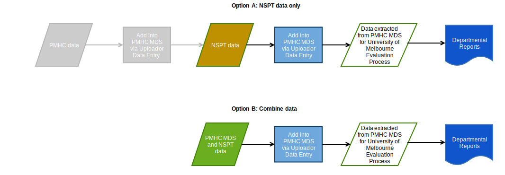
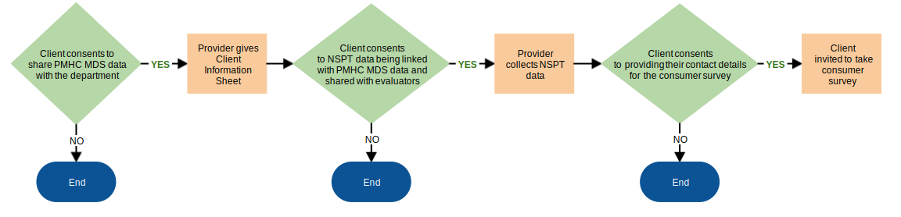

.. _data-collection:

Community-based Activity and Individual Services Data Collections
=================================================================

Taking a mixed-methods approach, the evaluation will collect both quantitative
and qualitative data from a variety of data sources. There are three sources of
quantitative data:

1.	Routinely collected data from the Primary Mental Health Care Minimum Dataset (PMHC) will be analysed.

2.	An additional trial-specific module has been developed for the PMHC minimum dataset to collect information required for the evaluation that is not currently captured in the PMHC minimum dataset. The items include a few additional socio-demographic and referral items as well as a brief outcome scale for suicidal thinking.

3.	Community-based Activity data will be collected using a data collection template that captures basic descriptive information about the activity and the number of attendees.

NSPT data providers can submit the following NSPT data via the existing PMHC MDS:

- :ref:`NSPT Community-based Activity Data only <data-collection-activity>`
- :ref:`NSPT Individual Services Data only <data-collection-individual>`
- :ref:`Combined NSPT Community-based Activity Data and NSPT Individual Services data <combined-data>`

See the below diagram for a full overview of how the NSPT :ref:`Community-based Activity <data-collection-activity>`
and :ref:`Individual Services <data-collection-individual>` data collection relates to
the existing PMHC MDS dataset.

.. _figure-data-model:

.. figure:: ../data-specification/figures/data-model.svg
   :alt: NSPT & PMHC data model

   NSPT data model *within the PMHC MDS*

.. _data-collection-activity:

NSPT Community-based Activity Data
~~~~~~~~~~~~~~~~~~~~~~~~~~~~~~~~~~

These are activities and programs funded by the Trial that are not individual
client services. They may include: capacity building and training for peers,
community or gatekeepers (e.g. QPR, ASSIST, Mental Health First Aid, Youth Aware
Mental Health, Roses in the Ocean training and so on), GP education, awareness
raising (events or media campaigns), and cultural or social and emotional
wellbeing programs for Aboriginal and Torres Strait Islander peoples.

Collecting Community-based Activity Data
^^^^^^^^^^^^^^^^^^^^^^^^^^^^^^^^^^^^^^^^
See :ref:`NSPT Community-based Activity data specifications. <nspt-individual-data-elements>`

Submitting Community-based Activity Data
^^^^^^^^^^^^^^^^^^^^^^^^^^^^^^^^^^^^^^^^
Community-based Activity Data can be directly submitted into the PMHC MDS either
via file upload or data entry.

See :ref:`getting-started` for more information.

.. _data-collection-individual:

NSPT Individual Services Data
~~~~~~~~~~~~~~~~~~~~~~~~~~~~~

These are services funded by the Trial that are delivered to individual clients
who have made a suicide attempt or are at risk for suicide. Services may include
counselling, non-clinical aftercare or support programs for individuals following
a suicide attempt, or non-clinical support to family members.

.. _data-collecting-individual:

Collecting Individual Services Data
^^^^^^^^^^^^^^^^^^^^^^^^^^^^^^^^^^^
For :ref:`nspt-individual-data-elements` there are two data specifications types:

- See :ref:`NSPT-Episode data specifications <nspt-episode-data-elements>` for Individual Services Data.
- See :ref:`SIDAS Outcome Collection Occasion data specifications <sidas-data-elements>` for Individual Services Data.

.. _data-submitting-individual:

Submitting Individual Services Data
^^^^^^^^^^^^^^^^^^^^^^^^^^^^^^^^^^^
As shown in the :ref:`data model <figure-data-model>`, Individual Services data
is captured as ':ref:`key-concepts-nspt-episode`' data, and relates to an
existing :ref:`PMHC MDS episode. <key-concepts-episode>`

For this reason, the related episode needs to exist in the PMHC MDS before the
NSPT Individual Services Data for that episode is submitted. An example of what
this means is that for every NSPT episode data and NSPT SIDAS data, there must
be a corresponding PMHC episode and PMHC client already recorded in the PMHC MDS.

To ensure individual PMHC data and individual NSPT data is linked accurately in
the MDS, submitting data providers will need to have a shared approach to their
PMHC colleagues. If you are not sure who manages the PMHC data submissions for
your organisation please contact the PMHC Helpdesk on support@pmhc-mds.com.

NSPT data providers have the following option to submit data to the PMHC MDS:

- Only NSPT Individual Services data (possible when PMHC client and episode data is already recorded in the MDS)
- Combination of NSPT Individual Services data and PMHC data

See diagram below to demonstrate these options:

.. _nspt_data_flow_diagram_colour:

   Adding NSPT data to the PMHC MDS model

Individual Services Data can be directly submitted into the PMHC MDS either via file
upload or data entry.

See :ref:`getting-started` for more information.

.. _data-collection-individual-consent:

Obtaining Consent from NSPT Individual Services Clients
^^^^^^^^^^^^^^^^^^^^^^^^^^^^^^^^^^^^^^^^^^^^^^^^^^^^^^^

For NSPT Individual Services, informed consent to participate in the NSPT data
collection is required from all clients receiving services provided as part of
the Trial. This is in addition to the routine consent obtained for the PMHC MDS.

There are two stages of NSPT Individual Services consent:

1.	Consent to collect the NSPT-specific data, to link that data with the routine PMHC MDS data, and for the evaluators to use the linked dataset.
2.	Consent for contact details and MDS ID to be disclosed to Strategic Data so clients can be invited to participate in a consumer survey.

The following diagram shows the steps in the consent process for the NSPT data.

   NSPT consent chart

At each stage if a client does not consent then no further data are collected and
no further consents sought.

Consent related documents are available in the :ref:`NSPT Resources <nspt_resources>`

Update client forms to capture NSPT Individual Services data
^^^^^^^^^^^^^^^^^^^^^^^^^^^^^^^^^^^^^^^^^^^^^^^^^^^^^^^^^^^^

When capturing NSPT Individual Services data, before uploading or entering individual
service data into the MDS, each service provider, in conjunction with their PHN, will need
to update their client forms in order to collect all the data required for the NSPT.

Please refer to:

- :ref:`NSPT Data Specifications <data-model-and-specifications>`
- PMHC notes on creating client forms at https://docs.pmhc-mds.com/data-specification/form-creation.html.

.. _combined-data:

Combined NSPT Community-based Activity Data and NSPT Individual Services data
~~~~~~~~~~~~~~~~~~~~~~~~~~~~~~~~~~~~~~~~~~~~~~~~~~~~~~~~~~~~~~~~~~~~~~~~~~~~~

For those Provider Organisations collecting both NSPT Community-based Activity data and NSPT Individual
Services data the data can be combined into the one MDS upload process. Each of the above-mentioned data elements must be collected and reported. Data Providers can submit:

- Only NSPT Community-based Activity and Individual Services data (possible when client and episode data are already recorded in the MDS)
- Combination of NSPT Community-based Activity and Individual Services data and PMHC data

See :ref:`nspt_data_flow_diagram_colour` diagram above to demonstrate these options.

.. _data-submission:

How are data being submitted?
=============================

Data providers (either the :ref:`key-concepts-primary-health-network` or their
:ref:`key-concepts-provider-organisation`) will be able to submit both
:ref:`nspt-activity-data-elements` and :ref:`nspt-individual-data-elements`
data via the existing PMHC MDS system, either by uploading a file or via data entry.

The PMHC MDS is able to accept data for any period, either in its entirety or
partially. Please note the system :ref:`reporting_timeliness`.

See :ref:`getting-started` for more information regarding the
data submission processes.

.. _data-review:

Reviewing NSPT data submitted to the MDS
~~~~~~~~~~~~~~~~~~~~~~~~~~~~~~~~~~~~~~~~

The PMHC MDS 'Reporting' role is available in a limited capacity for NSPT trial data.

Organisation will be able to extract all their PMHC MDS data, including the NSPT
datasets. Visit https://docs.pmhc-mds.com/user-documentation/data-extract.html
to see how to download an organsiation’s data.

There will be no formal NSPT reports created for the NSPT dataset.

If you have any concerns with your submitted data, please contact the University of Melbourne’s
:ref:`NSPT Evaluation Project Research Team <evaluation_project_team>` and the
PMHC MDS Helpdesk. Visit :ref:`getting-help-FAQs` for contact details.

.. _recording-support:

Support arrangements
====================

Support will be available to PHNs, Provider Organisations and where required their
third-party developers to assist with implementing upload facilities in existing
client management systems.

For those PHNs who do not upload via a client management system, documentation
and support will be available to manually create spreadsheets.

And for those using the data entry interface, support is also available to assist with
manually adding data to the PMHC MDS.

Visit :ref:`getting-help-FAQs` for contact details.
