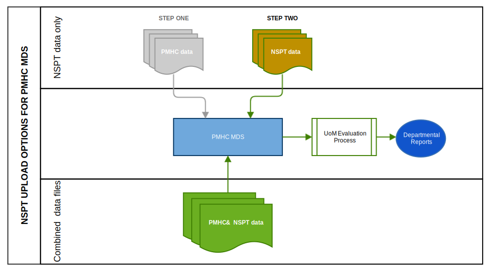

.. _upload_specification:

Upload Specification
====================

File types
^^^^^^^^^^

Files will be accepted in the following types:

- Comma Separated Values (CSV)
- Excel (XLSX)

Comma Separated Values (CSV)
~~~~~~~~~~~~~~~~~~~~~~~~~~~~

Requirements for CSV files:

- The CSV files must conform to `RFC 4180 <https://www.ietf.org/rfc/rfc4180.txt>`__.
- In addition, CSV files must be created using UTF-8 character encoding.
- CSV files must have the file extension .csv
- Multiple CSV files must be uploaded - one CSV file for each format described :ref:`below <nspt-files-to-upload>`.
- The CSV files must be compressed into a single file by zipping before upload. The filename of the zip file doesn't matter as long as it has the file extension .zip

Excel (XLSX)
~~~~~~~~~~~~

Requirements for XLSX files:

Excel files must be in XLSX format. The following versions of Excel support this format:

  - Excel 2007 (v12.0)
  - Excel 2010 (v14.0)
  - Excel 2013 (v15.0)
  - Excel 2016 (v16.0)

One XLSX file must be uploaded containing multiple worksheets - one worksheet
for each format described :ref:`below <nspt-files-to-upload>`.

When saving your file, please choose the filetype 'Excel Workbook (.xlsx)'.

The filename of the Excel file doesn't matter as long as it has the file extension .xlsx

.. _nspt-files-to-upload:

Files or worksheets to upload
^^^^^^^^^^^^^^^^^^^^^^^^^^^^^

The NSPT upload format is slightly different to the `PMHC MDS Version 1 upload format <https://docs.pmhc-mds.com/projects/data-specification/en/v1/upload-specification.html#file-format>`_.
Files and worksheets in the PMHC MDS standard format require the first line
of each file to have a version number. The NSPT upload format removes this line
from each file/worksheet and replaces it with a new metadata file/worksheet and
aligns with the `PMHC MDS Version 2 upload format <https://docs.pmhc-mds.com/projects/data-specification/en/v2/upload-specification.html#file-format>`_.

PMHC MDS standard uploads will accept this new Version 2 metadata file from 1 July 2019 - https://pmhc-mds.com/communications/#/2019/06/04/Contunity-of-Support-PMHC-Spec-v2-0/.

The NSPT files/worksheets can be uploaded to the PMHC MDS in one of two ways:

* :ref:`Option A: NSPT data files only <upload-option-A>` - Option A is
  recommended for organisations who are not yet ready to change their
  standard PMHC MDS uploads. It allows these organisations to
  do their normal PMHC MDS upload and then do a second upload for NSPT data.
  Option A is also recommended for organisations who use Data Entry instead of
  upload for the PMHC MDS data, but who wish to upload NSPT data.

* :ref:`Option B: Combination of PMHC and NSPT data files <upload-option-B>` -
  Option B is recommended for organisations who are ready to change their
  standard PMHC MDS uploads. It allows both PMHC MDS and NSPT data to be uploaded
  together in one upload.

.. _data-model-upload-diagram:

   NSPT upload data model *within the PMHC MDS*

.. _upload-option-A:

Option A: Uploading NSPT data files only
~~~~~~~~~~~~~~~~~~~~~~~~~~~~~~~~~~~~~~~~

There are two types of NSPT data:

* Community-based Activity data, and
* Individual Services data.

Some organisations will only collect one type of data
while other organisations will collect both. The system has been designed
to allow upload of only :ref:`Community-based Activity data <NSPT-activity-data>` or only
:ref:`Individual Services data <NSPT-individual-data>` or both
:ref:`Community-based Activity data and Individual Services data <NSPT-both-data>`
at the same time.

.. _NSPT-activity-data:

Uploading NSPT Community-based Activity data only
#################################################

These are activities and programs funded by the :ref:`NSPT trial <nspt_about>`
that are not individual client services.

See :ref:`key-concepts-activity` for definition of a Community-based Activity.

.. csv-table:: Summary of NSPT Activity file to upload
  :file: upload-file-types-activity-nspt.csv
  :header-rows: 1

For NSPT activity data uploads, an active Provider Organisation must already be
in the PMHC MDS for the PHN.

.. _NSPT-individual-data:

Uploading NSPT Individual Services data
#######################################

These are services funded by the :ref:`NSPT trial <nspt_about>` that are delivered
to individual clients who have made a suicide attempt or are at risk for suicide.
It is expected that these clients will already have contact data in the PMHC MDS.

See :ref:`key-concepts-individual-contact` for definition of an NSPT episode.

.. csv-table:: Summary of NSPT individual data files to upload
  :file: upload-file-types-nspt.csv
  :header-rows: 1

For NSPT individual client service data uploads, all corresponding files must already be
in the PMHC MDS.

An example of what this means is that for every row in the NSPT episode file/worksheet
and SIDAS file/worksheet, there must be a corresponding episode and client
already recorded in the PMHC MDS. If a client or episode is not already
in the PMHC MDS, then client and episode files/worksheets need to be supplied
specifying these clients and episodes. See Diagram at :ref:`upload_specification`

.. _NSPT-both-data:

Uploading both NSPT Community-based Activity and NSPT Individual Services data
##############################################################################

For those Provider Organisations collecting both **NSPT Community-based Activity data** and
**NSPT Individual Services data** files can be combined into the one upload process.
It is expected that these clients will already have contact data in the PMHC MDS.

.. csv-table:: Summary of NSPT Individual Services data files to upload
  :file: upload-file-types-nspt-activity-and-individual.csv
  :header-rows: 1

For :ref:`nspt-activity-data` uploads, an active Provider Organisation must already be
in the PMHC MDS for the PHN.

For :ref:`NSPT-individual-data` uploads, all corresponding files must already be
in the PMHC MDS.

.. _upload-option-B:

Option B: Uploading both PMHC MDS and NSPT data files
~~~~~~~~~~~~~~~~~~~~~~~~~~~~~~~~~~~~~~~~~~~~~~~~~~~~~

For those organisations who are ready to change their
standard PMHC MDS uploads, PMHC MDS and NSPT uploads can be combined together
in the one upload to the PMHC MDS.

The following NSPT data files can be included in the
PMHC MDS, depending on what type of NSPT data you are collecting:
- NSPT Community-based Activity data
- NSPT Individual Services data
- Both NSPT Community-based Activity and NSPT Individual Services data

.. csv-table:: Summary of NSPT files to include in a combined upload
  :file: upload-file-types-nspt-activity-and-individual-with-pmhc.csv
  :header-rows: 1

Examples
~~~~~~~~

Example 1
#########

If a Provider Organisation is collecting NSPT Individual Services data but
has not been required to upload to the PMHC MDS previously
as they have been doing data entry or because their PHN uploads on behalf of the
Provider Organisation, then the PMHC MDS will require
the Provider Organisation to include the following files/worksheets in the
upload.

.. csv-table:: Summary of PMHC files to include in a combined upload for a new Provider Organisation
  :file: upload-file-types-combined-new.csv
  :header-rows: 1

Example 2
#########

If a PHN or Provider Organisation already uploads PMHC data, the NSPT data can
be added to their current extract process for creating files and therefore uploaded to the PMHC MDS together.

The following PMHC files can be combined together with the relevant NSPT files above.

.. csv-table:: Summary of PMHC and NSPT files to include in a combined upload for a new Provider Organisation
  :file: upload-file-types-nspt-activity-and-individual-with-pmhc.csv
  :header-rows: 1

However, all files must be internally consistent. An example of what this means
is that for every NSPT episode, service contact and measures in an upload file,
there must be a corresponding episode in the episodes file/worksheet.
It also means that or every row in the episodes file/worksheet, there must be a
corresponding client in the clients file/worksheet.

.. _nspt-file-format:

File format
^^^^^^^^^^^

Requirements for file formats:

- The first row must contain the column headings as defined for each file type.
- Each item is a column in the file/worksheet. The 'Field Name' must be used for
  the column headings. The columns must be kept in the same order.
- The second and subsequent rows must contain the data.
- Data elements for each file/worksheet are defined at :ref:`record-formats`.
- For data elements that allow multiple values, each value should be separated by a space; for example: `1 3 6`.

All NSPT data uploads must include a Metadata file/worksheet. See :ref:`nspt-metadata-format`.

Each of the below example files assumes the following organisation structure:

+------------------+----------------------------+---------------------------------------------+---------------------+
| Organisation Key | Organisation Name          | Organisation Type                           | Parent Organisation |
+==================+============================+=============================================+=====================+
| PHN999           | Test PHN                   | Primary Health Network                      | None                |
+------------------+----------------------------+---------------------------------------------+---------------------+
| NFP01            | Test Provider Organisation | Private Allied Health Professional Practice | PHN999              |
+------------------+----------------------------+---------------------------------------------+---------------------+

Therefore the 'Organisation Path' for Test Provider Organisation is ``PHN999:NFP01``.

.. _nspt-metadata-format:

NSPT Metadata file
~~~~~~~~~~~~~~~~~~

All NSPT data uploads must include a Metadata file/worksheet.
- In the first row, the first cell must contain 'key' and the second cell must contain 'value'
- In the second row, the first cell must contain 'type' and the second cell must contain 'NSPT'
- In the third row, the first cell must contain 'version' and the second cell must contain '2.0'

i.e.:

+--------------+------------+
| key          | value      |
+--------------+------------+
| type         | NSPT       |
+--------------+------------+
| version      | 2.0        |
+--------------+------------+

Data elements for the NSPT metadata upload file/worksheet are defined at
:ref:`metadata-data-elements`.

Example NSPT metadata data:

.. This is a comment. NSPT metadata validation rules required!

- `CSV NSPT metadata file <../_static/metadata.csv>`_.
- `XLSX NSPT metadata worksheet <../_static/nspt-metadata-upload.xlsx>`_.

.. _nspt-organisation-format:

NSPT Organisation file format
~~~~~~~~~~~~~~~~~~~~~~~~~~~~~

This file is for PHN use only. The organisation file/worksheet is optional.
This is similar to the standard
`PMHC MDS Provider Organisation file/worksheet <https://docs.pmhc-mds.com/data-specification/upload-specification.html#organisation-format>`_
except the version line from the standard PMHC MDS file has been removed due
to the addition of the metadata file/worksheet.

Data elements for the Provider Organisation upload file/worksheet are defined
at `Provider Organisation data elements <https://docs.pmhc-mds.com/data-specification/data-model-and-specifications.html#provider-organisation-data-elements>`_.

Example organisation data:

- `CSV organisation file <../_static/organisations.csv>`_.
- `XLSX organisation worksheet <../_static/nspt-organisations-upload.xlsx>`_.

.. _nspt-only-activity-format:

NSPT Activity file format
~~~~~~~~~~~~~~~~~~~~~~~~~

For organisations reporting NSPT Community-based activities, the NSPT activity
file/worksheet is required to be uploaded each time. It is not required for
other organisations.

Data elements for the NSPT activity upload file/worksheet are defined at
:ref:`nspt-activity-data-elements`.

Example NSPT community-based data:

- `CSV NSPT activity file <../_static/nspt-activities.csv>`_.
- `XLSX NSPT activity worksheet <../_static/nspt-activity-upload.xlsx>`_.

.. _nspt-only-episode-format:

NSPT Episode file format
~~~~~~~~~~~~~~~~~~~~~~~~

For organisations reporting NSPT individual services data, the NSPT episode
file/worksheet is required to be uploaded each time. It is not required for
other organisations.

Data elements for the episode upload file/worksheet are defined at
:ref:`nspt-episode-data-elements`.

Example NSPT episode data:

- `CSV NSPT episode file <../_static/nspt-episodes.csv>`_.
- `XLSX NSPT episode worksheet <../_static/nspt-episodes-upload.xlsx>`_.

.. _nspt-only-sidas-format:

NSPT SIDAS Collection Occasion file format
~~~~~~~~~~~~~~~~~~~~~~~~~~~~~~~~~~~~~~~~~~

For organisations reporting NSPT individual services data, the SIDAS
file/worksheet is required to be uploaded each time. It is not required for
other organisations.

Data elements for the SIDAS collection occasion upload file/worksheet are defined
at :ref:`sidas-data-elements`.

Example SIDAS data:

- `CSV SIDAS file <../_static/sidas.csv>`_.
- `XLSX SIDAS worksheet <../_static/nspt-sidas-upload.xlsx>`_.

.. _nspt-client-format:

Client file format when combined with NSPT data
~~~~~~~~~~~~~~~~~~~~~~~~~~~~~~~~~~~~~~~~~~~~~~~

This is similar to the standard PMHC Client file/worksheet except the version
line from the standard PMHC file has been removed due to the addition of the
metadata file/worksheet.

The client file/worksheet is required to be uploaded each time for NSPT
individual services data or PMHC/NSPT combination files.

Data elements for the client upload file/worksheet are defined at `Client data elements <https://docs.pmhc-mds.com/data-specification/data-model-and-specifications.html#client-data-elements>`_.

Example client data:

- `CSV client file <../_static/clients.csv>`_.
- `XLSX client worksheet <../_static/pmhc-clients-upload.xlsx>`_.

.. _nspt-episode-format:

Episode file format when combined with NSPT data
~~~~~~~~~~~~~~~~~~~~~~~~~~~~~~~~~~~~~~~~~~~~~~~~

This is similar to the standard PMHC Episode file/worksheet except the version
line from the standard PMHC file has been removed due to the addition of the
metadata file/worksheet.

The episode file/worksheet is required to be uploaded each time for NSPT
individual services data or PMHC/NSPT combination files.

Data elements for the episode upload file/worksheet are defined
at `Episode data elements <https://docs.pmhc-mds.com/data-specification/data-model-and-specifications.html#episode-data-elements>`_.

Example episode data:

- `CSV episode file <../_static/episodes.csv>`_.
- `XLSX episode worksheet <../_static/pmhc-episodes-upload.xlsx>`_.

.. _nspt-service-contact-format:

Service Contact file format when combined with NSPT data
~~~~~~~~~~~~~~~~~~~~~~~~~~~~~~~~~~~~~~~~~~~~~~~~~~~~~~~~

This is similar to the standard PMHC Service Contact file/worksheet except the version
line from the standard PMHC file has been removed due to the addition of the
metadata file/worksheet.

The service contact file/worksheet is required to be uploaded each time for
PMHC/NSPT combination files.

Data elements for the service contact upload file/worksheet are defined
at `Service Contact data elements <https://docs.pmhc-mds.com/data-specification/data-model-and-specifications.html#service-contact-data-elements>`_.

Example service contact data:

- `CSV service contact file <../_static/service-contacts.csv>`_.
- `XLSX service contact worksheet <../_static/pmhc-service-contacts-upload.xlsx>`_.

.. _nspt-k10p-format:

K10+ file format when combined with NSPT data
~~~~~~~~~~~~~~~~~~~~~~~~~~~~~~~~~~~~~~~~~~~~~

This is similar to the standard PMHC K10+ file/worksheet except the version
line from the standard PMHC file has been removed due to the addition of the
metadata file/worksheet.

The K10+ file/worksheet is required to be uploaded each time for
PMHC/NSPT combination files.

Data elements for the K10+ upload file/worksheet are defined
at `K10+ data elements <https://docs.pmhc-mds.com/data-specification/data-model-and-specifications.html#k10>`_.

Example K10+ data:

- `CSV K10+ file <../_static/k10p.csv>`_.
- `XLSX K10+ worksheet <../_static/pmhc-k10p-upload.xlsx>`_.

.. _nspt-k5-format:

K5 file format when combined with NSPT data
~~~~~~~~~~~~~~~~~~~~~~~~~~~~~~~~~~~~~~~~~~~

This is similar to the standard PMHC K5 file/worksheet except the version
line from the standard PMHC file has been removed due to the addition of the
metadata file/worksheet.

The K5 file/worksheet is required to be uploaded each time for
PMHC/NSPT combination files.

Data elements for the K5 upload file/worksheet are defined
at `K5 data elements <https://docs.pmhc-mds.com/data-specification/data-model-and-specifications.html#k5>`_.

Example K5 data:

- `CSV K5 file <../_static/k5.csv>`_.
- `XLSX K5 worksheet <../_static/pmhc-k5-upload.xlsx>`_.

.. _nspt-sdq-format:

SDQ file format when combined with NSPT data
~~~~~~~~~~~~~~~~~~~~~~~~~~~~~~~~~~~~~~~~~~~~

This is similar to the standard PMHC SDQ file/worksheet except the version
line from the standard PMHC file has been removed due to the addition of the
metadata file/worksheet.

The SDQ file/worksheet is required to be uploaded each time for
PMHC/NSPT combination files.

Data elements for the SDQ upload file/worksheet are defined
at `SDQ data elements <https://docs.pmhc-mds.com/data-specification/data-model-and-specifications.html#sdq>`_.

Example SDQ data:

- `CSV SDQ file <../_static/sdq.csv>`_.
- `XLSX SDQ worksheet <../_static/pmhc-sdq-upload.xlsx>`_.

.. _nspt-practitioner-format:

Practitioners file format when combined with NSPT data
~~~~~~~~~~~~~~~~~~~~~~~~~~~~~~~~~~~~~~~~~~~~~~~~~~~~~~

This is similar to the standard PMHC Practitioner file/worksheet except the version
line from the standard PMHC file has been removed due to the addition of the
metadata file/worksheet.

When uploaded as part of a combined PMHC/NSPT upload, the Practitioner
file/worksheet is required for the first upload and when practitioner
information changes. It is optional otherwise.

Data elements for the Practitioner upload file/worksheet are defined
at `Practitioner data elements <https://docs.pmhc-mds.com/data-specification/data-model-and-specifications.html#practitioner-data-elements>`_.

Example Practitioner data:

- `CSV practitioner file <../_static/practitioners.csv>`_.
- `XLSX practitioner worksheet <../_static/pmhc-practitioners-upload.xlsx>`_.

.. _deleting-records:

Deleting records
~~~~~~~~~~~~~~~~

* Records of the following type can be deleted via upload:

  * NSPT Activity
  * NSPT Episode
  * SIDAS

* An extra optional "delete" column can be added to each of the supported
  upload files/worksheets.

* If included, this column must be the third column in each file, after the organisation
  path and the record's entity key.

* To delete a record, include its organisation path and its entity key, leave
  all other fields blank and put "delete" in the "delete" column. Please note
  that case is important. "DELETE" will not be accepted.

* Marking a record as deleted will require all child records of that record also
  to be marked for deletion. For example, marking a client as deleted will
  require all episodes, service contacts and collection occasions of that
  client to be marked for deletion.

* While deletions can be included in the same upload as insertions/updates,
  we recommend that you include all deletions in a separate upload that is
  uploaded before the insertions/updates.

Example NSPT files showing how to delete via upload:

NSPT Community-based Activity data
##################################

- `XLSX delete file containing only NSPT activity worksheet <../_static/nspt-activity-delete.xlsx>`_.
- `CSV delete NSPT activity file <../_static/nspt-activity-delete.csv>`_.

NSPT Individual Services data
#############################

- `XLSX delete file containing only NSPT worksheets <../_static/nspt-upload-delete.xlsx>`_.
- `CSV delete NSPT episode file <../_static/nspt-episodes-delete.csv>`_.
- `CSV delete SIDAS file <../_static/sidas-delete.csv>`_.
