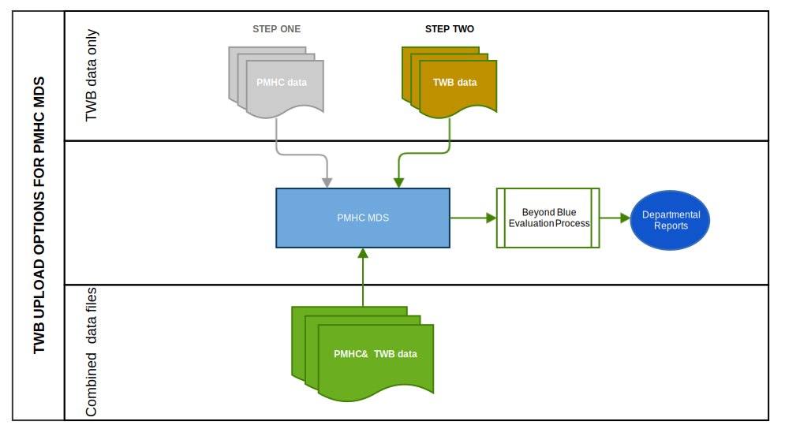

.. _upload_specification:

Upload Specification
====================

File types
^^^^^^^^^^

Files will be accepted in the following types:

- Comma Separated Values (CSV)
- Excel (XLSX)

Comma Separated Values (CSV)
~~~~~~~~~~~~~~~~~~~~~~~~~~~~

Requirements for CSV files:

- The CSV files must conform to `RFC 4180 <https://www.ietf.org/rfc/rfc4180.txt>`__.
- In addition, CSV files must be created using UTF-8 character encoding.
- CSV files must have the file extension .csv
- Multiple CSV files must be uploaded - one CSV file for each format described :ref:`below <twb-files-to-upload>`.
- The CSV files must be compressed into a single file by zipping before upload.
  The filename of the zip file doesn't matter as long as it has the file extension .zip

Excel (XLSX)
~~~~~~~~~~~~

Requirements for XLSX files:

Excel files must be in XLSX format. The following versions of Excel support this format:

  - Excel 2007 (v12.0)
  - Excel 2010 (v14.0)
  - Excel 2013 (v15.0)
  - Excel 2016 (v16.0)

One XLSX file must be uploaded containing multiple worksheets - one worksheet
for each format described :ref:`below <twb-files-to-upload>`.

When saving your file, please choose the filetype 'Excel Workbook (.xlsx)'.

The filename of the Excel file doesn't matter as long as it has the file extension .xlsx

.. _twb-files-to-upload:

Files or worksheets to upload
^^^^^^^^^^^^^^^^^^^^^^^^^^^^^

The TWB upload format is slightly different to the
`PMHC MDS Version 2.0 upload format <https://docs.pmhc-mds.com/projects/data-specification/en/v2/upload-specification.html#file-format>`_.

The TWB upload format separates collection occasion data into a separate
Collection Occasions worksheet so that multiple measures can be collected
at a single collection occasion.

The TWB upload format aligns with a future PMHC MDS Version 3.0 file format. No
date has been set for the release of the PMHC MDS Version 3.0 upload file format.

In addition to the collection occasion/measure changes, the TWB upload format
adds additional values to support the TWB extension.

TWB files/worksheets can be uploaded to the PMHC MDS in one of two ways:

* :ref:`Option A: Separate PMHC and TWB uploads <upload-option-A>` - Option A is
  recommended for organisations who have not yet changed their standard upload
  files to include TWB data. It allows these organisations to
  do their normal PMHC MDS upload and then do a second upload for TWB data.
  Option A is also recommended for organisations who use Data Entry instead of
  upload for the PMHC MDS data, but who wish to upload TWB data.

* :ref:`Option B: One upload including PMHC and TWB clients <upload-option-B>` -
  Option B is recommended for organisations who have already migrated their
  standard PMHC MDS uploads to allow TWB uploads at the same time. It allows
  both PMHC MDS and TWB data to be uploaded together in one upload.

.. _data-model-upload-diagram:

   TWB upload data model *within the PMHC MDS*

When uploading TWB data files only the following files/worksheets can be
uploaded to the PMHC MDS:

.. csv-table:: Summary of files to upload
  :file: upload-file-types-twb.csv
  :header-rows: 1

All files must be internally consistent. An example of what this means
is that for every TWB episode, service contact and measures in an upload file,
there must be a corresponding episode in the episodes file/worksheet.
It also means that or every row in the episodes file/worksheet, there must be a
corresponding client in the clients file/worksheet.

.. _upload-option-A:

Option A: Separate PMHC and TWB uploads
~~~~~~~~~~~~~~~~~~~~~~~~~~~~~~~~~~~~~~~

When uploading standard PMHC clients and TWB clients separately, the upload
for the standard PMHC clients should use the
`PMHC MDS Version 2.0 upload format <https://docs.pmhc-mds.com/projects/data-specification/en/v2/upload-specification.html#file-format>`_
and the upload for the TWB clients should use the format as described in this document.

.. _upload-option-B:

Option B: One upload including PMHC and TWB clients
~~~~~~~~~~~~~~~~~~~~~~~~~~~~~~~~~~~~~~~~~~~~~~~~~~~

For those organisations who are ready to change their
standard PMHC MDS uploads, PMHC MDS and TWB uploads can be combined together
in the one upload to the PMHC MDS.

In this instance, when reporting non TWB clients, please use `0: PHN funded` for :ref:`dfn-funding_source`.

.. _twb-file-format:

File format
^^^^^^^^^^^

Requirements for file formats:

- The first row must contain the column headings as defined for each file type.
- Each item is a column in the file/worksheet. The 'Field Name' must be used for
  the column headings. The columns must be kept in the same order.
- The second and subsequent rows must contain the data.
- Data elements for each file/worksheet are defined at :ref:`record-formats`.
- For data elements that allow multiple values, each value should be separated by a space; for example: `1 3 6`.

All TWB data uploads must include a Metadata file/worksheet. See :ref:`metadata-format`.

Each of the below example files assumes the following organisation structure:

+------------------+----------------------------+---------------------------------------------+---------------------+
| Organisation Key | Organisation Name          | Organisation Type                           | Parent Organisation |
+==================+============================+=============================================+=====================+
| PHN999           | Test PHN                   | Primary Health Network                      | None                |
+------------------+----------------------------+---------------------------------------------+---------------------+
| NFP01            | Test Provider Organisation | Private Allied Health Professional Practice | PHN999              |
+------------------+----------------------------+---------------------------------------------+---------------------+

Therefore the 'Organisation Path' for Test Provider Organisation is ``PHN999:NFP01``.

.. _metadata-format:

Metadata file
~~~~~~~~~~~~~

All TWB data uploads must include a Metadata file/worksheet.
- In the first row, the first cell must contain 'key' and the second cell must contain 'value'
- In the second row, the first cell must contain 'type' and the second cell must contain 'WAYBACK'
- In the third row, the first cell must contain 'version' and the second cell must contain '3.0'

i.e.:

+--------------+------------+
| key          | value      |
+--------------+------------+
| type         | WAYBACK    |
+--------------+------------+
| version      | 3.0        |
+--------------+------------+

Data elements for the TWB metadata upload file/worksheet are defined at
:ref:`metadata-data-elements`.

Example TWB metadata data:

.. This is a comment. TWB metadata validation rules required!

- `CSV TWB metadata file <../_static/metadata.csv>`_.
- `XLSX TWB metadata worksheet <../_static/twb-metadata-upload.xlsx>`_.

.. _organisation-format:

Organisation file format
~~~~~~~~~~~~~~~~~~~~~~~~

This file is for PHN use only. The organisation file/worksheet is optional.
This is similar to the standard
`PMHC MDS Provider Organisation file/worksheet <https://docs.pmhc-mds.com/data-specification/upload-specification.html#organisation-format>`_.

Data elements for the Provider Organisation upload file/worksheet are defined
at `Provider Organisation data elements <https://docs.pmhc-mds.com/data-specification/data-model-and-specifications.html#provider-organisation-data-elements>`_.

Example organisation data:

- `CSV organisation file <../_static/organisations.csv>`_.
- `XLSX organisation worksheet <../_static/twb-organisations-upload.xlsx>`_.

.. _client-format:

Client file format
~~~~~~~~~~~~~~~~~~

The client file/worksheet is required to be uploaded each time.

Data elements for the client upload file/worksheet are defined at `Client data elements <https://docs.pmhc-mds.com/data-specification/data-model-and-specifications.html#client-data-elements>`_.

Example client data:

- `CSV client file <../_static/clients.csv>`_.
- `XLSX client worksheet <../_static/pmhc-clients-upload.xlsx>`_.

.. _episode-format:

Episode file format
~~~~~~~~~~~~~~~~~~~

The episode file/worksheet is required to be uploaded each time.

Data elements for the episode upload file/worksheet are defined
at `Episode data elements <https://docs.pmhc-mds.com/data-specification/data-model-and-specifications.html#episode-data-elements>`_.

Example episode data:

- `CSV episode file <../_static/episodes.csv>`_.
- `XLSX episode worksheet <../_static/pmhc-episodes-upload.xlsx>`_.

.. _twb-episode-format:

TWB Episode file format
~~~~~~~~~~~~~~~~~~~~~~~

The TWB episode file/worksheet is required to be uploaded each time.

Data elements for the TWB Episode upload file/worksheet are defined at
:ref:`twb-episode-data-elements`.

Example TWB episode data:

- `CSV TWB episode file <../_static/twb-episodes.csv>`_.
- `XLSX TWB episode worksheet <../_static/twb-episodes-upload.xlsx>`_.

.. _twb-pnpc-format:

TWB PNPC file format
~~~~~~~~~~~~~~~~~~~~

The TWB PNPC (Primary Nominated Professional Contacts) file/worksheet is
required to be uploaded each time.

Data elements for the TWB PNPC upload file/worksheet are defined at
:ref:`twb-pnpc-data-elements`.

Example TWB PNPC data:

- `CSV TWB PNPC file <../_static/twb-pnpcs.csv>`_.
- `XLSX TWB PNPC worksheet <../_static/twb-pnpcs-upload.xlsx>`_.

.. _twb-critical-incident-format:

TWB Critical Incident file format
~~~~~~~~~~~~~~~~~~~~~~~~~~~~~~~~~

The TWB Critical Incident file/worksheet is required to be uploaded each time.

Data elements for the TWB Critical Incident upload file/worksheet are defined at
:ref:`twb-critical-incident-data-elements`.

Example TWB Critical Incident data:

- `CSV TWB Critical Incident file <../_static/twb-critical-incidents.csv>`_.
- `XLSX TWB Critical Incident worksheet <../_static/twb-critical-incidents-upload.xlsx>`_.

.. _twb-recommendation-out-format:

TWB Recommendation Out file format
~~~~~~~~~~~~~~~~~~~~~~~~~~~~~~~~~~

The TWB Recommendation Out file/worksheet is required to be uploaded each time.

Data elements for the TWB Recommendation Out upload file/worksheet are defined at
:ref:`twb-recommendation-out-data-elements`.

Example TWB Recommendation Out data:

- `CSV TWB Recommendation Out file <../_static/twb-recommendation-outs.csv>`_.
- `XLSX TWB Recommendation Out worksheet <../_static/twb-recommendation-outs-upload.xlsx>`_.

.. _collection-occasion-format:

Collection Occasion file format
~~~~~~~~~~~~~~~~~~~~~~~~~~~~~~~

The Collection Occasion file/worksheet is required to be uploaded each time.

Data elements for the Collection Occasion upload file/worksheet are defined at
:ref:`collection-occasion-data-elements`.

Example Collection Occasion data:

- `CSV Collection Occasion file <../_static/collection-occasions.csv>`_.
- `XLSX Collection Occasion worksheet <../_static/collection-occasions-upload.xlsx>`_.

.. _k10p-format:

K10+ file format
~~~~~~~~~~~~~~~~

The K10+ file/worksheet is required to be uploaded each time.

Data elements for the K10+ upload file/worksheet are defined
at :ref:`k10p-data-elements`.

Example K10+ data:

- `CSV K10+ file <../_static/k10p.csv>`_.
- `XLSX K10+ worksheet <../_static/pmhc-k10p-upload.xlsx>`_.

.. _k5-format:

K5 file format
~~~~~~~~~~~~~~

The K5 file/worksheet is required to be uploaded each time.

Data elements for the K5 upload file/worksheet are defined
at :ref:`k5-data-elements`.

Example K5 data:

- `CSV K5 file <../_static/k5.csv>`_.
- `XLSX K5 worksheet <../_static/pmhc-k5-upload.xlsx>`_.

.. _sdq-format:

SDQ file format
~~~~~~~~~~~~~~~

The SDQ file/worksheet is required to be uploaded each time.

Data elements for the SDQ upload file/worksheet are defined
at :ref:`sdq-data-elements`.

Example SDQ data:

- `CSV SDQ file <../_static/sdq.csv>`_.
- `XLSX SDQ worksheet <../_static/pmhc-sdq-upload.xlsx>`_.

.. _who5-format:

WHO-5 file format
~~~~~~~~~~~~~~~~~

The WHO-5 file/worksheet is required to be uploaded each time.

Data elements for the WHO-5 upload file/worksheet are defined
at :ref:`who5-data-elements`.

Example WHO-5 data:

- `CSV WHO-5 file <../_static/who5.csv>`_.
- `XLSX WHO-5 worksheet <../_static/who5-upload.xlsx>`_.

.. _sidas-format:

SIDAS file format
~~~~~~~~~~~~~~~~~

The SIDAS file/worksheet is required to be uploaded each time.

Data elements for the SIDAS upload file/worksheet are defined
at :ref:`sidas-data-elements`.

Example SIDAS data:

- `CSV SIDAS file <../_static/sidas.csv>`_.
- `XLSX SIDAS worksheet <../_static/sidas-upload.xlsx>`_.

.. _twb-plan-format:

TWB Plan file format
~~~~~~~~~~~~~~~~~~~~

The TWB Plan file/worksheet is required to be uploaded each time.

Data elements for the TWB Plan upload file/worksheet are defined
at :ref:`twb-plan-data-elements`.

Example TWB Plan data:

- `CSV TWB Plan file <../_static/twb-plans.csv>`_.
- `XLSX TWB Plan worksheet <../_static/twb-plans-upload.xlsx>`_.

.. _twb-ni-format:

TWB Needs Identification file format
~~~~~~~~~~~~~~~~~~~~~~~~~~~~~~~~~~~~

The TWB NI file/worksheet is required to be uploaded each time.

Data elements for the TWB NI upload file/worksheet are defined
at :ref:`twb-ni-data-elements`.

Example TWB Plan data:

- `CSV TWB NI file <../_static/twb-nis.csv>`_.
- `XLSX TWB NI worksheet <../_static/twb-nis-upload.xlsx>`_.

.. _service-contact-format:

Service Contact file format
~~~~~~~~~~~~~~~~~~~~~~~~~~~

The service contact file/worksheet is required to be uploaded each time.

Data elements for the service contact upload file/worksheet are defined
at :ref:`service-contact-data-elements`.

Example service contact data:

- `CSV service contact file <../_static/service-contacts.csv>`_.
- `XLSX service contact worksheet <../_static/pmhc-service-contacts-upload.xlsx>`_.

.. _practitioner-format:

Practitioner file format
~~~~~~~~~~~~~~~~~~~~~~~~

The Practitioner file/worksheet is required for the first upload and when practitioner
information changes. It is optional otherwise.

Data elements for the Practitioner upload file/worksheet are defined
at `Practitioner data elements <https://docs.pmhc-mds.com/data-specification/data-model-and-specifications.html#practitioner-data-elements>`_.

Example Practitioner data:

- `CSV practitioner file <../_static/practitioners.csv>`_.
- `XLSX practitioner worksheet <../_static/pmhc-practitioners-upload.xlsx>`_.

.. _deleting-records:

Deleting records
~~~~~~~~~~~~~~~~

* Records of the following type can be deleted via upload:

  * Client
  * Episode
  * TWB Episode
  * TWB Primary Nominated Professional Contact
  * TWB Critical Incident
  * TWB Recommendation Out
  * Collection Occasion
  * K10+
  * K5
  * SDQ
  * WHO-5
  * SIDAS
  * TWB Plan
  * TWB NI
  * Practitioner

* An extra optional "delete" column can be added to each of the supported
  upload files/worksheets.

* If included, this column must be the third column in each file, after the organisation
  path and the record's entity key.

* To delete a record, include its organisation path and its entity key, leave
  all other fields blank and put "delete" in the "delete" column. Please note
  that case is important. "DELETE" will not be accepted.

* Marking a record as deleted will require all child records of that record also
  to be marked for deletion. For example, marking a client as deleted will
  require all episodes, service contacts and collection occasions of that
  client to be marked for deletion.

* While deletions can be included in the same upload as insertions/updates,
  we recommend that you include all deletions in a separate upload that is
  uploaded before the insertions/updates.

Example TWB files showing how to delete via upload:

TWB Episode data
################

- `XLSX delete file containing only TWB worksheets <../_static/twb-upload-delete.xlsx>`_.
- `CSV delete TWB episode file <../_static/twb-episodes-delete.csv>`_.
