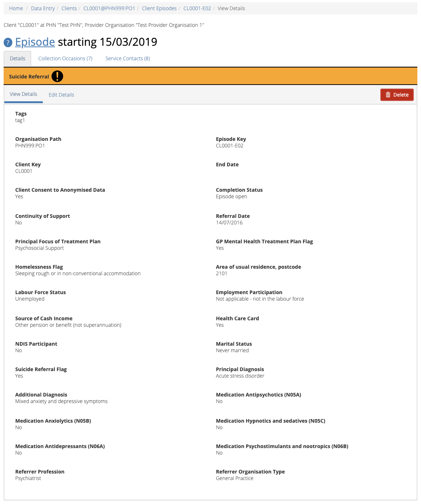
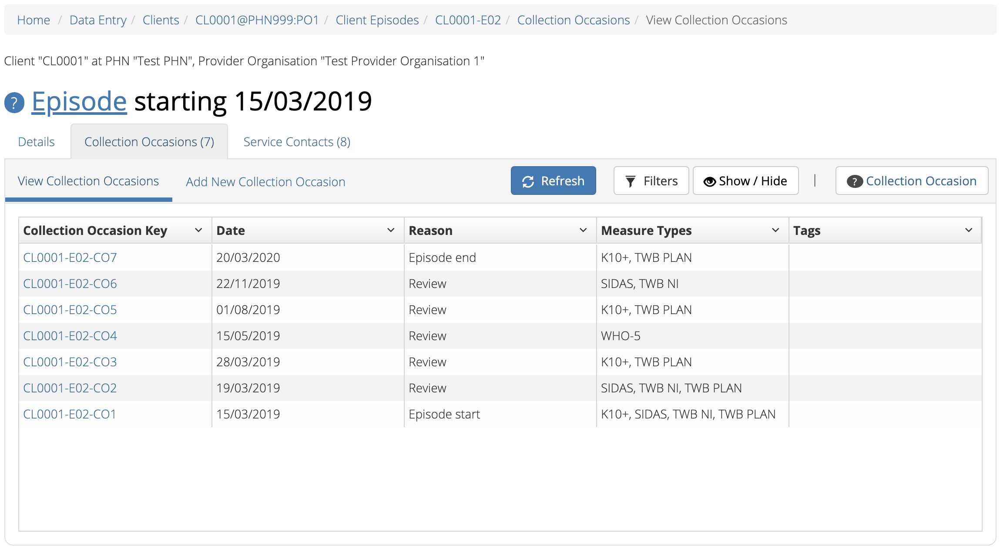

.. _data-entry-user-docs:

Data Entry
==========

NSPT is an extension of the Primary Mental Health Care Minimum Data Set (PMHC MDS);
current PMHC MDS Data online User Guide for Data Entry is available to be viewed at
https://docs.pmhc-mds.com/user-documentation/data-entry.html.

.. _activities:

Community-based Activity Data Entry
^^^^^^^^^^^^^^^^^^^^^^^^^^^^^^^^^^^

.. _find-activities:

Finding an Activity
-------------------

You can search for activities assigned to an organisation through the
Data Entry tab, by following these steps:

1. Click on the Activities tab.

.. figure:: screen-shots/activities-view.png
   :alt: PMHC MDS Activities Table View

*Please note: If you can not view the Activities tab please contact your PHN to
request the National Suicide Prevention Trial (NSPT) access to be granted to your
Provider Organisation.*

.. _search-activities:

Filter Activities Results
-------------------------

To filter the listed activities:

  1. Click the grey 'Filters' button.
  2. Start typing in an edit box now displayed under the column headers.
  3. To remove the filter, click the grey cross within the edit box beside any entered text or click the grey 'Filters' button.

.. figure:: screen-shots/activities-results-filter.png
   :alt: Activities Data Results Filtered

.. _view-activities:

Viewing an Activity
-------------------

You can view activities details through :ref:`find-activities`
on the Data Entry tab, by following these steps:

1. Click on the :ref:`Activities <find-activities>` tab.
2. Click on the Activity Key in blue displayed within the table list.

.. figure:: screen-shots/activities-details.png
   :alt: PMHC MDS Activities Details View

.. _add-activities:

Adding an Activity
------------------

You can view activities details through :ref:`find-activities`
on the Data Entry tab, by following these steps:

1. Click on the :ref:`Activities <find-activities>` tab.
2. Click the Add Activity tab.
3. Enter the activity's details. Mandatory fields are marked with an * .

       .. figure:: screen-shots/activities-add-view.png
          :alt: PMHC MDS Activities Details View

4. Click the blue 'Save' button.  (If you decide not to save changes, you can simply navigate away from this screen)

You will receive confirmation that the activity's details have been added,
and it will now be displaying these new details in the View Details tab.

        .. figure:: screen-shots/saved.png
           :alt: Activities Data Saved Successfully

If you receive an error message, the data will need to be corrected before the
record is saved and added to the PMHC MDS.
See Validation Rules - :ref:`NSPT Activites<activities-nspt-current-validations>`

You can add a activities individually through the data entry interface or
alternately, activities records can be uploaded in bulk. See: :ref:`upload_specification`

.. _edit-activities:

Editing an Activity
-------------------

You can view activities details through :ref:`find-activities`
on the Data Entry tab, by following these steps:

1. Click on the :ref:`Activities <find-activities>` tab.
2. Click on the Activity Key in blue displayed within the table list.
3. From the View Details tab, click the Edit Details tab.
4. Update the activity's details. Mandatory fields are marked with an * .

    *Please note: You can edit the Activity Key from this screen. See* :ref:`edit-activities-key`.

.. figure:: screen-shots/activities-view-edit.png
   :alt: PMHC MDS Activities Details View

5. Click the blue 'Save' button. (If you decide not to save changes, you can simply navigate away from this screen)

You will receive confirmation that the activity's details have been added,
and it will now be displaying these new details in the View Details tab.

        .. figure:: screen-shots/saved.png
           :alt: Activities Data Saved Successfully

If you receive an error message, the data will need to be corrected before the
record is saved and added to the PMHC MDS.
See Validation Rules - :ref:`NSPT Activites<activities-nspt-current-validations>`

.. _edit-activities-key:

Editing an Activity Key
~~~~~~~~~~~~~~~~~~~~~~~

You can edit the identification key for an activity through :ref:`edit-activities`
available on the Data Entry tab, by following these steps:

1. In step four when :ref:`edit-activities`.
2. From the Activities Edit Details tab, click the 'Edit Key' button.

       .. figure:: screen-shots/activities-key-edit.png
          :alt: Activities Data Edit Activity Key

3. Type in the new activities key and click 'Next'.

       .. figure:: screen-shots/activities-key-confirm.png
          :alt: Activities Data Confirm Changed Activity Key

4. Double check the new key is correct and click save. If it is incorrect, click back to re-enter the key or click the light grey 'cross' in the top right to cancel this key change request.

You will receive confirmation that the Activities's key has been saved, and the screen
will now be displaying the updated activities key details in the Activities View Details tab.

       .. figure:: screen-shots/activities-key-saved.png
          :alt: Activity Key Saved Successfully

.. _delete-activities:

Deleting an Activity
--------------------

Currently you can not delete an activity. This feature will be released in the future.

In the interim, any urgent delete requests should be directed to the PMHC Helpdesk on support@pmhc-mds.com.

Individual Services Data Entry
^^^^^^^^^^^^^^^^^^^^^^^^^^^^^^

PMHC Client Data
----------------

For more detail on how to search, find, view, add, edit or delete Client PMHC data in the PMHC MDS,
please visit the PMHC User Guide at https://docs.pmhc-mds.com/user-documentation/data-entry.html#client-data.

PMHC Episodes
-------------

For more detail on how to find, view, add, edit or delete Client PMHC Episode data in the PMHC MDS,
please visit the PMHC User Guide at https://docs.pmhc-mds.com/user-documentation/data-entry.html#episodes.

.. _nspt-episode-data:

NSPT-Episode
^^^^^^^^^^^^

You can view a client’s episodes through Viewing a Client’s details available on the Data Entry tab, by following these steps:

.. _view-episodes:

Viewing a Client's PMHC Episode
-------------------------------

You can view a client's NSPT episodes through viewing a client's details
available on the Data Entry tab, by following these steps:

1. Search for the client using one of the three search fields.

.. figure:: screen-shots/client-search-fields.png
   :alt: Client Search View

2. Click on the Client Key in blue displayed within the table list.

.. figure:: screen-shots/client-search-results.png
   :alt: Client Search View

3. From the Client's Summary tab, you can shortcut straight to an episode by clicking
   the Blue Episode Key displayed in the snapshot of the five most recent episodes.

4. Alternately, if you would like to view all episodes you can click on the
   Episode Tab. The heading for this tab displays in brackets the total number of episodes recorded
   in the PMHC MDS for this client at Provider Organisations for which you have access.

A table will display all the Client's Episodes at Provider Organisations for which you have access.

.. figure:: screen-shots/client-episodes-summary.png
   :alt: Client Data Summary View

A Drop down list is available to view:

* All Episodes
* Currently Open Episodes
* Closed Episodes

To view the Client's Episode details, click the Blue Episode Key.

A page will display the Client's PMHC Episode details.

.. _add-nspt-episode:

Adding a Client's NSPT Episode data
-----------------------------------

You can edit a Client's PMHC Episode details through :ref:`view-episodes`
available on the Data Entry tab, by following these steps:

1. Once :ref:`view-episodes`.
2. From the Client's Episode table, click the Episode Key.
3. Click Edit Details tab.
4. Add ``!nspt`` in the 'Tags' fields and press tab

.. figure:: screen-shots/client-episodes-nspt-tag.png
   :alt: Client Episodes NSPT Tag

5. Scroll to the bottom of the PMHC Episode
Add the Client's NSPT Episode details. Mandatory fields are marked with an * . (Specification :ref:`NSPT Episode Data Elements <nspt-episode-data-elements>`)

.. figure:: screen-shots/client-episodes-nspt-add.png
   :alt: Client Episodes Edit Details

5. Click the blue 'Save' button. (If you decide not to add NSPT data, you can simply navigate away from this screen)

You will receive confirmation that the Client's Episode details have been saved,
and it will now be displaying.

        .. figure:: screen-shots/saved.png
           :alt: Client Episode Data Saved Successfully

If you receive an error message, the data will need to be corrected before the
record is saved and added to the PMHC MDS.
See Validation Rules - :ref:`NSPT Episode <episode-nspt-current-validations>`

.. _edit-napt-episode:

Editing a Client's NSPT-Episode data
------------------------------------

You can edit a Client's PMHC Episode details through :ref:`view-episodes`
available on the Data Entry tab, by following these steps:

1. Once :ref:`view-episodes`.
2. From the Client's Episode table, click the Episode Key.
3. Click Edit Details tab.
4. Scroll to the bottom of the PMHC Episode.

Update the Client's NSPT Episode details. Mandatory fields are marked with an * . (Specification :ref:`NSPT Episode Data Elements <nspt-episode-data-elements>`)

.. figure:: screen-shots/client-episodes-nspt-edit.png
   :alt: Client Episodes Edit Details

5. Click the blue 'Save' button. (If you decide not to save changes, you can simply navigate away from this screen)

You will receive confirmation that the Client's NSPT Episode details have been saved,
and it will now be displaying these new details in the Episode View Details tab.

        .. figure:: screen-shots/saved.png
           :alt: Client Episode Data Saved Successfully

If you receive an error message, the data will need to be corrected before the
record is saved and added to the PMHC MDS.
See Validation Rules - :ref:`NSPT Episode <episode-nspt-current-validations>`

.. _delete-episode:

Deleting an NSPT Episode
-------------------------

Currently you can not delete an NSPT Episode. This feature will be released in the future.

In the interim, any urgent delete requests should be directed to the PMHC Helpdesk on support@pmhc-mds.com.

.. _confirm-delete-episode:

.. _outcome-collection-occasion-data:

SIDAS Outcome Collection Occasions
^^^^^^^^^^^^^^^^^^^^^^^^^^^^^^^^^^

.. _view-collection-occasion:

Viewing a Client's SIDAS Outcome Collection Occasions for an Episode
--------------------------------------------------------------------

You can view a client's outcome collection occasions through :ref:`view-episodes`
available on the Data Entry tab, by following these steps:

1. Once :ref:`Viewing the Client's Episode <view-episodes>`.
2. Click the Episode Collection Occasions Tab.
   This tab displays in brackets the total number of collection occasions recorded
   in the PMHC MDS for this episode.

A table will display all the Collection Occasions linked to this Client's Episode.

3. To view the Collection Occasions details, click the Blue Collection Occasions Key.

.. figure:: screen-shots/client-collection-occasions-SIDAS-view.png
   :alt: Client Episode Collection Occasions Details View

A page will display the Collection Occasions details as recorded via the
:ref:`Outcome Collection Occasion Data Elements <outcome-collection-occasion-data-elements>`.

.. _add-collection-occasion:

Adding an NSPT Client's SIDAS Outcome Collection Occasions data
---------------------------------------------------------------

You can add a Client's Outcome Collection Occasions through :ref:`view-collection-occasion`
available on the Data Entry tab, by following these steps:

1. Once :ref:`view-collection-occasion`.
2. Firstly double check the Collection Occasions is not already showing.
3. Click the Add New Collection Occasion tab.
4. Select the Collection Occassion Measure - SIDAS.

.. figure:: screen-shots/client-collection-occasions-measure-SIDAS.png
   :alt: Client Data Add Collection Occasions

5. Enter the Client's SIDAS Collection Occasions details for the NSPT episode. Mandatory fields are marked with an * . (Specification :ref:`SIDAS Collection Occasions Data Elements <outcome-collection-occasion-data-elements>`)

.. figure:: screen-shots/client-collection-occasions-SIDAS-add.png
   :alt: Client Data Add Collection Occasions

7. Click the blue 'Save' button. (If you decide not to add this client's episode, you can simply navigate away from this screen)

You will receive confirmation that the Client's Collection Occasions details have been added,
and it will now be displaying these new details in the View Collection Occasions Details tab.

        .. figure:: screen-shots/client-SIDAS-saved-add.png
           :alt: Client Data Saved Successfully

If you receive an error message, the data will need to be corrected before the
record is saved and added to the PMHC MDS.
See Validation Rules - SIDAS :ref:`NSPT SIDAS<sidas-nspt-current-validations>`

.. _edit-collection-occasion:

Editing a Client's SIDAS Outcome Collection Occasions for an Episode
--------------------------------------------------------------------

You can edit a client's Outcome Collection Occasions through :ref:`view-collection-occasion`
available on the Data Entry tab, by following these steps:

1. Once :ref:`view-collection-occasion`.
2. Click the Collection Occasions Key.
3. Click Edit Details tab.
4. Update the Client's Collection Occasions details. Mandatory fields are marked with an * .(Specification :ref:`Collection Occasions Data Elements <outcome-collection-occasion-data-elements>`)

    *Please note: You can edit the Collection Occasion Key from this screen. See* :ref:`edit-collection-occasion-key`.

.. figure:: screen-shots/client-collection-occasions-SIDAS-edit.png
   :alt: Client Collection Occasions Edit Details

5. Click the blue 'Save' button. (If you decide not to save changes, you can simply navigate away from this screen)

You will receive confirmation that the Client's Collection Occasions details have been saved,
and it will now be displaying these new details in the View Collection Occasions Details tab.

        .. figure:: screen-shots/client-SIDAS-saved-edit.png
           :alt: Client Data Saved Successfully

If you receive an error message, the data will need to be corrected before the
record is saved and added to the PMHC MDS.
See Validation Rules - SIDAS :ref:`NSPT SIDAS<sidas-nspt-current-validations>`

.. _edit-collection-occasion-key:

Editing a SIDAS Collection Occasion Key
~~~~~~~~~~~~~~~~~~~~~~~~~~~~~~~~~~~~~~~

You can edit an collection occasion's identification key through :ref:`view-episodes`
available on the Data Entry tab, by following these steps:

1. In step four when :ref:`edit-collection-occasion`.
2. From the Collection Occasion Edit Details tab, click the 'Edit Key' button.

       .. figure:: screen-shots/client-collection-occasions-edit-key.png
          :alt: Client Data Edit Collection Occasion Key

3. Type in the new collection occasion key and click 'Next'.
4. Double check the new key is correct and click save. (If it is incorrect, click back to re-enter the key or click the 'cross' in the top right to cancel this key change request)

You will receive confirmation that the Collection Occasion's key has been saved, and the screen
will now be displaying the updated collection occasion key details in the Collection Occasions View Details tab.

       .. figure:: screen-shots/saved.png
          :alt: Collection Occasion Key Saved Successfully

.. _delete-collection-occasion:

Deleting a SIDAS Outcome Collection Occasion
--------------------------------------------

You can delete a Client's Outcome Collection Occasion through ':ref:`view-collection-occasion`'
available on the Data Entry tab, by following these steps:

1. Once :ref:`view-collection-occasion`.
2. Click the Collection Occasions Key.
3. Click Edit Details tab.
4. Click the red 'Delete' button.
5. You will be displayed a 'Confirm Deletion' screen.

  **Please note: Once the collection occasion is deleted, you will not be able to recover this collection occasion data.**

6. Click the blue 'Confirm' button to delete this collection occasion. (or click the orange 'Cancel' button if you decide not to delete this collection occasion data)

  .. figure:: screen-shots/client-collection-occasions-SIDAS-delete-confirm.png
     :alt: Client Collection Occasion Data Confirm Delete

After you click 'Confirm', you will receive confirmation that the collection occasion has
been deleted, and you will be redirected to the :ref:`View Collection Occasions <view-collection-occasion>` where the
collection occasion will no longer be displayed.

    .. figure:: screen-shots/client-collection-occasions-SIDAS-delete-successful.png
       :alt: Client Collection Occasion Data Delete Successful
