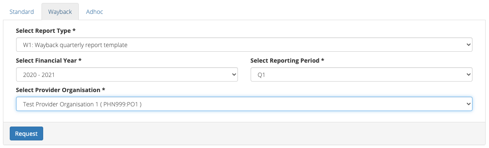

.. _reports-user-docs:

Reports User Guide
==================

The Way Back (TWB) Support Service Minimum Data Set is an extension of the
Primary Mental Health Care Minimum Data Set (PMHC MDS);
current PMHC MDS online User Guide for Reports is available to be viewed at
https://docs.pmhc-mds.com/projects/user-documentation/en/latest/reporting.html.

.. _produce-system-report:

How to produce a Wayback report
^^^^^^^^^^^^^^^^^^^^^^^^^^^^^^^

You can produce the Wayback report by following these steps:

1. Navigate to the **Reports** tab
2. Click the **Wayback** tab (NOTE: this tab will only be displayed when TWB data has been added to the PMHC MDS)

3. Select the :ref:`Report Type <system-report-types>`
4. Select the Financial Year & Reporting Period, or Start/End Date & Reporting Level
5. Select the name of the Provider Organisation from the drop down list, if not pre-filled
6. Click the blue **View** button, or the selected format and click the **Download** button

   Please note: for the W1, click the blue **Request** button

   A dialogue box will be displayed, showing that the file is being requested from the server

   When the file is ready, a 'File ready for download' message will be displayed
   Click the blue **Download** button

.. figure:: screen-shots/reports-message-download.png
   :alt: PMHC MDS File Selected

   An Excel spreadsheet will be downloaded to your computer

NOTE: The W1 spreadsheet will then require some manual completion of information
not available to the PMHC-MDS system. Once complete send it on to Beyond Blue or
your PHN.

.. _system-report-types:

Types of Wayback reports
^^^^^^^^^^^^^^^^^^^^^^^^

.. _category-w1:

Report W1: Wayback Quarterly Report Template
^^^^^^^^^^^^^^^^^^^^^^^^^^^^^^^^^^^^^^^^^^^^

The Way Back Quarterly reporting function allows users to automatically populate
The Way Back Quarterly Report using data contained in the PMHC MDS. This spreadsheet
will then require some manual completion of information not available to the
PMHC-MDS system before providing to Beyond Blue or your PHN.

Many of the items reported are summarised over two time periods - reporting
period and year to date. The former is always a full quarter worth of data
as selected in the drop down boxes on the report generation page, unless the
most recent quarter has been selected in which case it will be all data from
the start of the current quarter until the day the report is generated.
Financial years are listed in the report dropdowns with both relevant calendar
years listed (e.g. **2020 - 2021**). The year to date figure is always from
July 1 of the earlier calendar year until either the end of the selected
reporting period or the date the report was generated if the current quarter
is selected.

The first section of the report explicitly details the dates covered by the
reporting period and the year to date, as well as identifying the time at which
it was generated.

Activity Data
"""""""""""""

New Client Episodes
  This is the number of episodes commenced during the relevant period
  (reporting or YTD). A key concept here is the episode start date. This is
  defined as the date of the earliest contact, even if the client is a no-show,
  but only if there is at least one attended contact during the reporting period.

Number of Completed Episodes (Exits)
  Any episode with an
  `Episode - End Date <https://docs.pmhc-mds.com/projects/data-specification/en/v2/data-model-and-specifications.html#episode-end-date>`_
  during the relevant period.

Number of Completed Episodes (Service Complete)
  The subset of Completed Episodes as defined immediately above that have an
  `Episode - Completion Status <https://docs.pmhc-mds.com/projects/data-specification/en/latest/data-model-and-specifications.html#episode-completion-status>`_
  of  `1: Episode closed - treatment completed`

Number of Administratively Closed Episodes
  The subset of Completed Episodes as defined above that have an
  `Episode - Completion Status <https://docs.pmhc-mds.com/projects/data-specification/en/latest/data-model-and-specifications.html#episode-completion-status>`_
  between 2 and 6 inclusive, indicating an administrative closure.

Client Profile
""""""""""""""

The first three elements in the Client Profile summarise new episodes by client
gender:

Male
  The number of episodes started during the relevant period where the
  `Client - Gender <https://docs.pmhc-mds.com/projects/data-specification/en/latest/data-model-and-specifications.html#episode-completion-status>`_
  is indicated as `1: Male`

Female
  The number of episodes started during the relevant period where the
  `Client - Gender <https://docs.pmhc-mds.com/projects/data-specification/en/latest/data-model-and-specifications.html#episode-completion-status>`_
  is indicated as `2: Female`

Other
  The number of episodes started during the relevant period where the
  `Client - Gender <https://docs.pmhc-mds.com/projects/data-specification/en/latest/data-model-and-specifications.html#episode-completion-status>`_
  is indicated as `3: Other`

The next 2 elements summarise new episodes for clients in at risk groups

Aboriginal and Torres Strait Islander
  The number of episodes started during the relevant period where the
  `Client - Aboriginal and Torres Strait Islander Status <https://docs.pmhc-mds.com/projects/data-specification/en/latest/data-model-and-specifications.html#client-aboriginal-and-torres-strait-islander-status>`_
  was 1,2 or 3, indicating Aboriginal or Torres Strait Islander origin or both.

LGBTIQ
  The number of episodes started during the relevant period where the client
  indicates a `TWB Episode - Sexual Orientation <https://docs.pmhc-mds.com/projects/data-specification-wayback/en/v3/data-specification/data-model-and-specifications.html#twb-episode-sexual-orientation>`_
  other than `1: Straight or heterosexual` or `9: Not stated`.

The final section in the Client Profile is Age Profile, summarising the number
of new episodes in the relevant period by the client's age group at the time
the episode began. This is derived from `Client - Date of Birth <https://docs.pmhc-mds.com/projects/data-specification/en/latest/data-model-and-specifications.html#client-date-of-birth>`_,
using only records where `Client - Estimated Date of Birth Flag <https://docs.pmhc-mds.com/projects/data-specification/en/latest/data-model-and-specifications.html#client-estimated-date-of-birth-flag>`_
is not a dummy date (code 8) and is not missing (code 9).

Referral Profile
""""""""""""""""

The Referral Profile summarises referral criteria (essentially eligibility
codes) and sources for episodes starting in the reporting period. There is
no corresponding profile for the Year To Date.

Primary Referral Criteria
  The number of episodes starting in the reporting period with
  `TWB Episode – Eligibility Type <https://docs.pmhc-mds.com/projects/data-specification-wayback/en/v3/data-specification/data-model-and-specifications.html#twb-episode-eligibility-type>`_
  Code: 1

Secondary Referral Criteria
  The number of episodes starting in the reporting period with
  `TWB Episode – Eligibility Type <https://docs.pmhc-mds.com/projects/data-specification-wayback/en/v3/data-specification/data-model-and-specifications.html#twb-episode-eligibility-type>`_
  Code: 2

Referral Source
  The number of episodes starting in the reporting period with
  `Episode - Referrer Organisation Type <https://docs.pmhc-mds.com/projects/data-specification/en/v2/data-model-and-specifications.html#episode-referrer-organisation-type>`_
  codes of:

  Hospital ED
    * `7: Emergency Department`

  Hospital Ward
    * `5: Public Hospital`
    * `6: Private Hospital`

  Community Mental Health Service
    * `4: Public mental health service`

  Other
    * All the other codes (1-3,8-21,98,99)

Service Contact Data
""""""""""""""""""""

The service contact section of the report is concerned exclusively with the
`Service Contact - Modality <https://docs.pmhc-mds.com/projects/data-specification/en/latest/data-model-and-specifications.html#service-contact-modality)>`_.
For all contacts in the relevant period it is a simple count of the number of
contact each modality:

* `1: Face to Face`
* `2: Telephone`
* `3: Video`
* `4: Internet-based`

Client Measures and Experience
""""""""""""""""""""""""""""""

Information about three clinical measures is reported in this section. For each
measure there are three summary statistics:

1. The number of episodes with (valid) initial measures collected during the
   reporting period
2. The number of episodes with (valid) final measures collected during the
   reporting period
3. The number of episodes with (valid) final measures collected during the
   reporting period that also have (valid) initial measures (not necessarily
   during the reporting period)

Information about collection occasions - including dates and reasons - is
available `in the Collection Occasion specification documentation <https://docs.pmhc-mds.com/projects/data-specification-wayback/en/v3/data-specification/data-model-and-specifications.html#collection-occasion>`_.
A critical feature of a collection occasion is its "reason", which is actually
about the point in the clients' journey when the measure was taken. For
reporting purposes this can be either "inital" (i.e. start of the episode) or
final (end of the episode). Note however that the collection occasion dates
need not be the same as the episode start and end dates. Measures can be
collected on any day.

The specific measures of interest are the K10+, the WHO-5, and the SIDAS.
Information about these measures - including what constitutes a valid measure
- can be accessed `in the Collection Occasion Key Concepts documentation <https://docs.pmhc-mds.com/projects/data-specification-wayback/en/v3/data-specification/key-concepts.html#collection-occasion>`_.

Although there should be no cases where an episode has multiple instances of
a particular measure taken at any collection occasion identified as initial
or final, if such an anomaly occurs the CO is still included as having the
initial/final/paired measure. In other words the technical definition of
"having a measure" is interpreted as "having one or more instances of the
relevant measure".

Issues and Risks
""""""""""""""""

This section counts client deaths and suicide attempts during the relevant
reporting period and year-to-date. Details about such events are available
`in the TWB Critical Incident - Date documentation <https://docs.pmhc-mds.com/projects/data-specification-wayback/en/v3/data-specification/data-model-and-specifications.html?highlight=critical%20incidents#twb-critical-incident-type>`_.
Codes 2 and 3 comprise deaths; code 1 indicates a suicide attempt.

Key Performance Indicators
""""""""""""""""""""""""""

The KPIs produced by the automated reports are all based on particular events
occurring within a certain number of days of a precipitating event. KPIs
pertain to the reporting period only.

Each KPI reports a reference population (the number in the 'Calc B' column)
and the subset of that population that meets the criteria in the 'Target Metric'
column ('Calc A'). Note that a population in this case means a count of
episodes, not a number of people.  The ratio is presented as a percentage
in the '% Achieved During' column.

Business days are defined as Monday to Friday inclusive, unless they are
listed in `this document <http://public_holidays.csv>`_ which has been derived
from `information at the Digital Transformation Office <https://data.gov.au/dataset/ds-dga-b1bc6077-dadd-4f61-9f8c-002ab2cdff10/details?q=>`_.
The business day calculator takes into account the jurisdiction (state or
territory of the service). A week is defined as 5 business days.

Correspondence with Primary Nominated Professional on Entry to the Service
--------------------------------------------------------------------------

The reference population here is the number of episodes for which the client’s
Primary Nominated Professional was contacted during the reporting period
(described in more detail
`in the TWB Episode - Primary Nominated Professional Consent Date documentation <https://docs.pmhc-mds.com/projects/data-specification-wayback/en/v3/data-specification/data-model-and-specifications.html#twb-episode-primary-nominated-professional-consent-date>`_ ).
This date is defined as the date that consent was obtained. The numerator is
the number of these episodes for which correspondence was sent advising them
of their client’s participation in The Way Back Support Service within three
business days of consent being obtained. The business days is computed as
`TWB Episode - Primary Nominated Professional Contact Entry Date <https://docs.pmhc-mds.com/projects/data-specification-wayback/en/v3/data-specification/data-model-and-specifications.html#twb-episode-primary-nominated-professional-contact-entry-date>`_
minus
`TWB Episode - Primary Nominated Professional Contact – Entry Date <https://docs.pmhc-mds.com/projects/data-specification-wayback/en/v3/data-specification/data-model-and-specifications.html#twb-episode-primary-nominated-professional-consent-date>`_.

Correspondence with Primary Nominated Professional on Exit from the Service
---------------------------------------------------------------------------

This is the equivalent of the above for notifying a PNP of a client's _exit_
from the service. The relevant population is all episodes with an end date
during the reporting period and have a
`TWB Episode - Primary Nominated Professional <https://docs.pmhc-mds.com/projects/data-specification-wayback/en/v3/data-specification/data-model-and-specifications.html#twb-episode-primary-nominated-professional>`_
in the range 1-6 or 98. The numerator includes the subset of these episodes
where the
`TWB Episode - Primary Nominated Professional Contact Exit Date <https://docs.pmhc-mds.com/projects/data-specification-wayback/en/v3/data-specification/data-model-and-specifications.html#twb-episode-primary-nominated-professional-contact-exit-date>`_
is within 3 days of the
`Episode - End Date <https://docs.pmhc-mds.com/projects/data-specification/en/v2/data-model-and-specifications.html#episode-end-date>`_.

Safety Plan Update / Development
--------------------------------

The relevant episodes here are those where the first and second attended
service contacts fall within the reporting period, and the the episode has an
initial collection occasion with a corresponding
`TWB Plan - Plan Type <https://docs.pmhc-mds.com/projects/data-specification-wayback/en/v3/data-specification/data-model-and-specifications.html#twb-plan-plan-type>`_
equal to `1: Safety Plan`. The numerator is the subset of these episodes for
which the collection occasion date is before or on the same day as the second
attended contact.

Support Plan Development
------------------------

The relevant episodes here are those where there the first attended service
contact is within the reporting period, and the the episode has an initial
collection occasion with a corresponding
`TWB Plan - Plan Type <https://docs.pmhc-mds.com/projects/data-specification-wayback/en/v3/data-specification/data-model-and-specifications.html#twb-plan-plan-type>`_
equal to `2: Support Plan`. The numerator is the subset of these episodes for
which the collection occasion date is not more than 10 days after the initial
service contact.

.. _category-w2:

Report W2 — High level summary of overall volumes by entity
^^^^^^^^^^^^^^^^^^^^^^^^^^^^^^^^^^^^^^^^^^^^^^^^^^^^^^^^^^^

The W2 provides an overview of The Way Back (TWB) activity undertaken during the reporting period. It uses the same assumptions as the standard A1 report. It is a ‘one page’ view, with data aggregated for the specified reporting period, covering counts of clients, episodes and service contacts.

Key specifications:

* Data in this report is all associated with an Active TWB Episode, as shown in the 'Active Episodes' column counts. This means the episode must appear in the :ref:`TWB Episode table <data-model>`, and must have an Active Contact during the reporting period. A !`wayback` tag on the main episode table is NOT sufficient for the episode to be included in this report.
* The 'Active Contacts' column counts all the `Attended Service Contacts <https://docs.pmhc-mds.com/projects/data-specification/en/v2/data-model-and-specifications.html#attended-service-contact`_ (i.e. non-no show) that occurred during the reporting period that were associated with an Active TWB Episode.
* The 'Active Clients' column counts the number of unique clients who were the recipient of services delivered as part of an Active TWB Episode.

.. _category-w3:

Report W3 - Data Quality Report: Missing TWB Episode data
^^^^^^^^^^^^^^^^^^^^^^^^^^^^^^^^^^^^^^^^^^^^^^^^^^^^^^^^^

The W3 is a summary The Way Back (TWB) format report that provides a simple listing of missing/invalid data rates for relevant TWB Episode data elements. It is analogous to the `standard A4 report <https://docs.pmhc-mds.com/projects/user-documentation/en/latest/reporting.html#a4-data-quality-report-missing-and-invalid-episode-data>`_ that deals with the standard PMHC Episode elements with missing data.

Key specifications:

* As for the W2, data in this report is all associated with an Active TWB Episode; however, for this report there is slightly tighter criteria regarding what it means to be active. Rather than the usual one or more `Attended Service Contact <https://docs.pmhc-mds.com/projects/data-specification/en/v2/data-model-and-specifications.html#attended-service-contact`_ during the reporting period, for the W3 and W4, there must be at least TWO such contacts (i.e. non-no shows) during the reporting period). The episode must appear in the :ref:`TWB Episode table <data-model>`. This number is reported in the column labelled 'Number of active episodes in period'.
* The 'Number of active episodes with missing data' column counts, separately for each of the TWB Episode record elements, how many episodes have the pertinent missing value code. For the elements "Method of Suicide Attempt" and "Primary Nominated Professional", 'Other' (code 98) is counted as a missing value as well as 'Not stated/Inadequately described' (code 99).
* The '% Missing Data' column is a simple percentage of the active episodes that have missing data, calculated from the preceding two columns.

.. _category-w4:

Report W4 - Data Quality Report: Missing TWB Needs Identification and Recommendation Outs
^^^^^^^^^^^^^^^^^^^^^^^^^^^^^^^^^^^^^^^^^^^^^^^^^^^^^^^^^^^^^^^^^^^^^^^^^^^^^^^^^^^^^^^^^

The W4 is a summary The Way Back (TWB) format report that provides a simple listing of missing/invalid data rates for relevant TWB Needs Identification and TWB Recommendation Outs data elements. It does the same job for these elements as the W3 does for TWB Episode data elements, and uses the same assumptions.
Key specifications:

* As for the W2, data in this report is all associated with an Active TWB Episode; however, for this report there is slightly tighter criteria regarding what it means to be active. Rather than the usual one or more `Attended Service Contact <https://docs.pmhc-mds.com/projects/data-specification/en/v2/data-model-and-specifications.html#attended-service-contact`_ during the reporting period, for the W3 and W4, there must be at least TWO such contacts (i.e. non-no shows) during the reporting period). The episode must appear in the :ref:`TWB Episode table <data-model>`. This number is reported in the column labelled 'Number of active episodes in period'.
* The 'Number of active episodes with missing data' column counts, separately for each of the TWB Episode record elements, how many episodes have the pertinent missing value code. For both elements "Needs Identification" and "Recommendation Out", 'Other' (code 98) is counted as a missing value as well as 'Not stated/Inadequately described' (code 99).
* The '% Missing Data' column is a simple percentage of the active episodes that have missing data, calculated from the preceding two columns.
